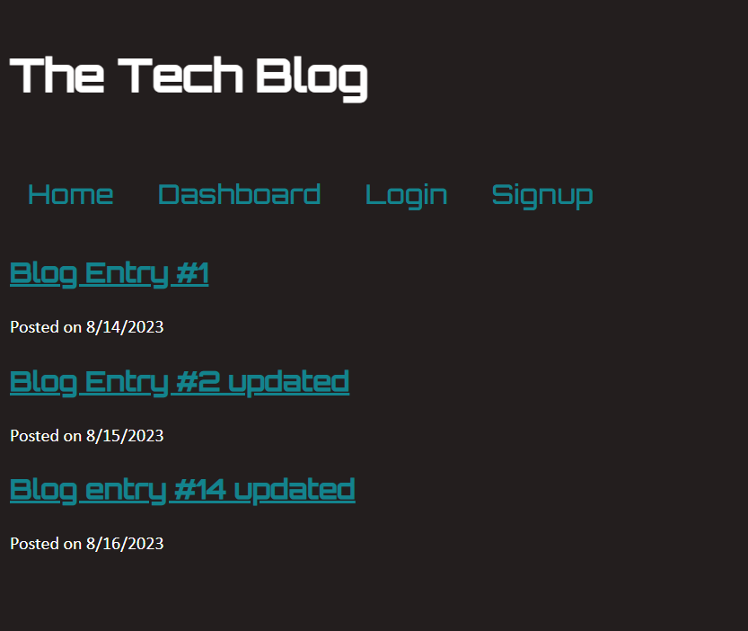

# MVC Tech Blog

## Description/What I attempted to do

Build a tech blog site where users can read others' blog posts, comment on them, and sign up/log in to submit their own posts. This application follows the MVC structure and uses Handlebars.js, Sequelize and Express-session. I built this application as a way to keep a collection of tech related blog entries. As part of this project, I learned how use Handlebars, Sequelize and MySQL together.

## Table of Contents

### [Usage](#usage)

### [License](#license)

### [Contributing](#contributing)

### [Questions](#questions)

## Usage

The user can view all blog post titles on the home page and click on specific ones to read and comment on them. Users can sign up and then log in to create their own posts, delete them or edit them.

## License

The license for this project is MIT and the link for license information is https://opensource.org/licenses/MIT.

## Contributing/Acknowledgements

Tips from University of Minnesota Full Stack Bootcamp instructor Gary Almes and notes from class sessions.

Tips from tutoring session with Alexis San Javier through University of Minnesota coding boot camp.

## Questions

Please find more information at my GitHub, located [here](https://github.com/Jacqueline-Stiehl).
If you have additional questions, please contact me at salsajackie@yahoo.com.

## Screen shot

## Link to the working version of the code

https://github.com/Jacqueline-Stiehl/mvc-tech-blog-jstiehl

## URL of deployed application

## Heroku

Heroku app name: note-taker-jstiehl:

https://watch.screencastify.com/v/JagzrlsAW8cYQZ1BSETk
